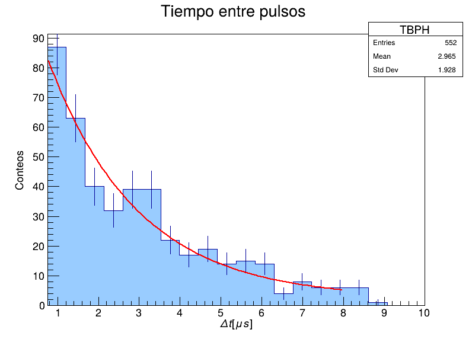

# Vida-media-del-muon

Con los datos obtuvimos la siguiente grafica que es consistente para la vida media del muón.

 

Se determinó la vida media del muón como $\tau_\mu =  2.19 \pm 0.04\mu s$, compatible con el valor de referencia en 0.17$\sigma$.
